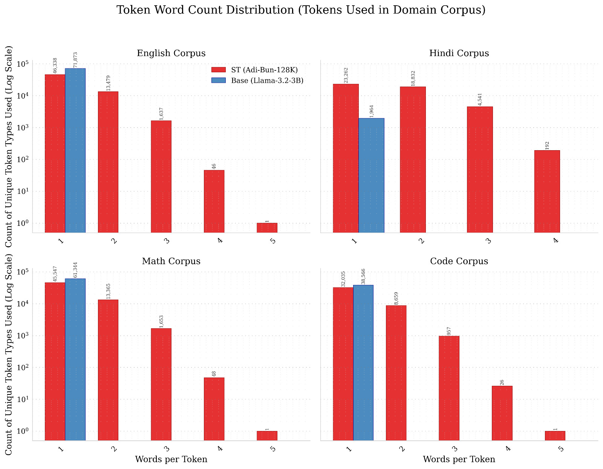
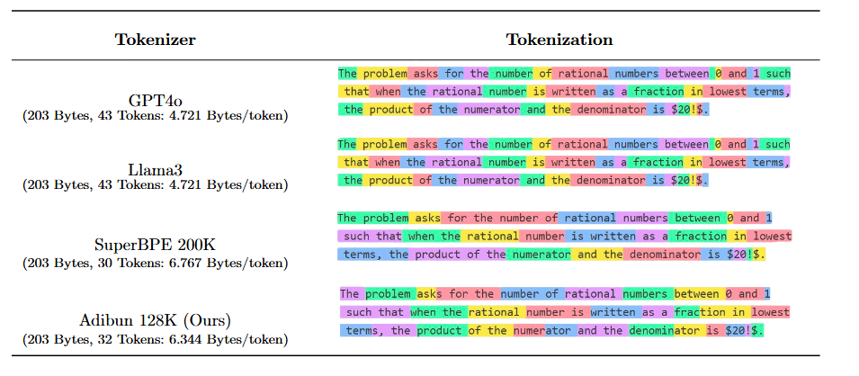

# SuperTokenizer

SuperTokenizer leverages probabilistic, character-based pretokenization to enable multi-word tokens, overcoming the limitations of traditional whitespace-based tokenization. This approach allows a single token to span multiple words, improving tokenization efficiency and flexibility for NLP models.

## Key Features
- **SuperBPE**: Unlike SuperBPE 
   * It provides Multi-word subword tokenization i.e like (`ed to the`, `tion of the`) etc..
   * Does everything in a single pass of training and fully compatible with `hf/tokenizers` 
- **Probabilistic Pretokenization:** Uses a user-configurable probability distribution to chunk text, enabling tokens to span across word boundaries.
- **Multi-Word Tokens:** Unlike whitespace-based pretokenization, tokens can now represent multiple words, improving compression and representation.
- **YAML-based Configuration:** All training and tokenizer parameters are managed via a single `train.yaml` file for reproducibility and easy experimentation.

---

## How It Works
Traditional tokenizers split text at whitespace, so a token cannot span more than one word. SuperTokenizer uses a character-level probabilistic chunking process (see `test_distribution` in `train.yaml`) to insert a separator at variable-length intervals. This allows the tokenizer to learn tokens that can represent multiple words or subwords, based on the distribution you specify.

**Example:**
- With whitespace tokenization: `"I love AI"` → `["I", "love", "AI"]`
- With probabilistic chunking: `"I love AI"` might become `["I love", "AI"]` or `["I", "love AI"]` depending on the sampled chunk lengths.


Here is a comparison with Llama-3 vs Adi-Bun (Super-Tokenizer)




---

## Configuration (train.yaml)
Edit `train.yaml` to control all aspects of training:


- **test_distribution:** Controls the probability of chunk lengths for separator insertion. Probabilities must sum to 1.0. By default, this is a Gaussian/normal distribution over character chunk lengths by default (see below for details).
- **separator:** The string used to mark chunk boundaries during pretokenization.
- **push_to_hub:** Fill in your HuggingFace token to upload the trained tokenizer.

---

## Gaussian Distribution for Chunk Lengths

The `test_distribution` in `train.yaml` is now set to approximate a **Gaussian (normal) distribution** over character chunk lengths. This means the probability of splitting at a certain chunk length follows a bell curve, with most splits happening near the mean length and fewer at very short or very long chunks. You can adjust the range and shape by editing the YAML.

**Example:**
```yaml
test_distribution:
  "4-5": 0.044
  "6-7": 0.091
  "8-9": 0.146
  "10-11": 0.171
  "12-13": 0.185
  "14-15": 0.171
  "16-17": 0.146
  "18-19": 0.091
  "20-21": 0.044
  "22-23": 0.011
```

---

## Visualization: Distribution Plotting

When you launch `train.py`, the script will **plot the current chunk splitting probability distribution** (from `test_distribution`) and overlay a true Gaussian/normal curve for comparison. This visual guide helps you understand and tune how your character chunking will behave before any training starts.

- The plot shows the probability of each chunk length/range being selected for a split.
- The baseline Gaussian curve is computed using the same min/max as in your YAML.
- This feature makes it easy to compare your custom distribution to a true normal distribution and experiment with different chunking strategies.

---

## Usage
1. **Install requirements:**
   - `pip install tokenizers transformers datasets pyyaml matplotlib`
2. **Edit `train.yaml`:**
   - Adjust parameters and fill in your HuggingFace token if pushing to hub.
3. **Run training:**
   ```bash
   python train.py
   ```
4. **Result:**
   - The trained tokenizer will be saved to the path specified in `output_path`.
   - If configured, it will also be pushed to the HuggingFace Hub.
   - The chunk split distribution plot will be shown before training starts.

---

## Advanced
- Modify the `test_distribution` in YAML to experiment with different chunking behaviors. For a more peaked or flatter distribution, adjust the probabilities or the range.
- All other settings (vocab size, dataset, etc.) can be controlled via YAML for reproducibility.

---

## Concept & Implementation Note
This project **emulates probabilistic character splitting** by augmenting the dataset with a unique separator, then using the `removed` behavior of HuggingFace's tokenizer regex pre-tokenizer to split on this separator. This is not native probabilistic pretokenization in `hf/tokenizers`, but a robust and practical emulation. The separator is never seen by the model, and chunk boundaries are sampled according to your chosen distribution, allowing for flexible and realistic multi-word token learning.

---

